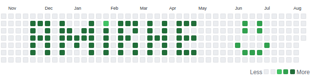

⚡ If **premature optimization** is the root of all evil, Then I have an **evil factory**.   
💬 If you are searching for **new idea**, there you are.  
⚡ I explain things in a **complex** and **precise** manner **from the beginning**.  
🚒 **Kryptonite** and **misconceptions** about other's profession are two of my **main weaknesses**.  
🎨 I occasionally **draw** somethings.  

<!--

   
  

 -->

  
  &nbsp;&nbsp;
  <b>⇌</b>
  

❤️ `Next.js` `react` `neo4j` `PyTorch` `spiking neural network` `NLP` `Typescript` `rust` 

  
 

## My Latest Hashnode Blogposts
 <!-- BLOG-POST-LIST:START -->
- [Docker start for frontend devleop](https://amirhe.hashnode.dev/docker-start-for-frontend-devleop)
- [Changing root git history](https://amirhe.hashnode.dev/changing-root-git-history)
- [Proxy cool array methods](https://amirhe.hashnode.dev/proxy-cool-array-methods)
- [Use package.json wisely](https://amirhe.hashnode.dev/use-packagejson-wisely)
- [Unleash the power of bookmarklets](https://amirhe.hashnode.dev/unleash-the-power-of-bookmarklets)
<!-- BLOG-POST-LIST:END -->
 

